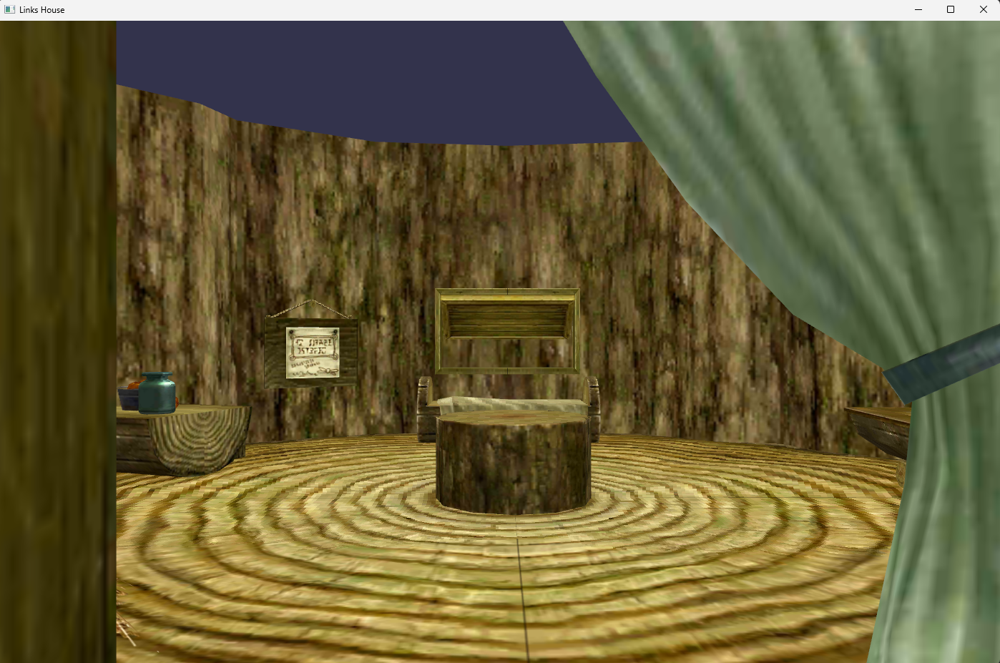
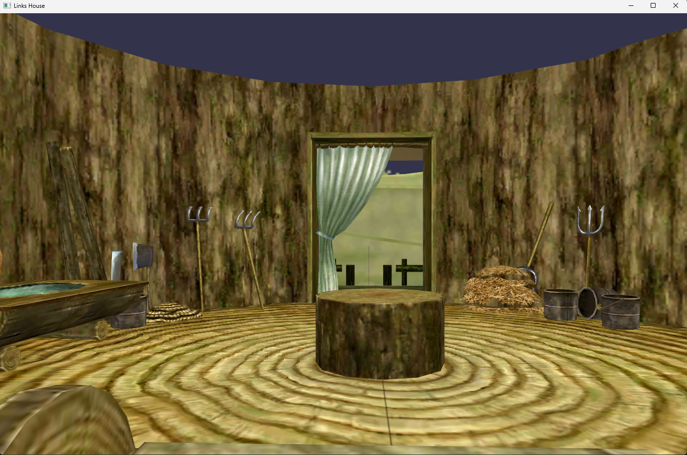
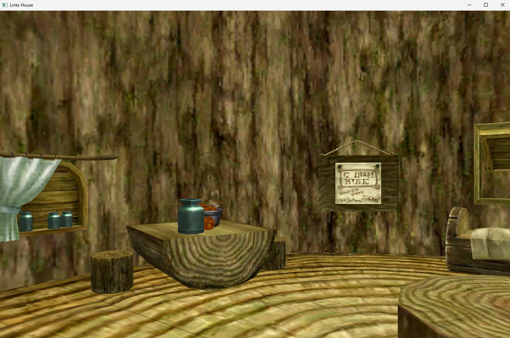
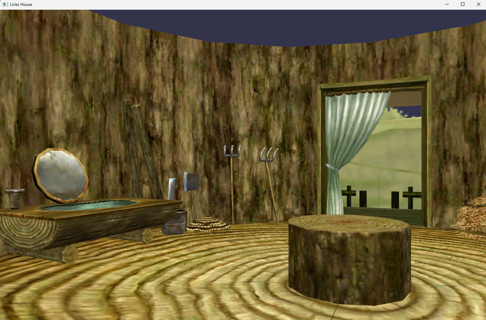

# Links House

A textured mesh renderer built with OpenGL that visualizes a simplified 3D model of Link’s iconic house. This program loads `.ply` mesh data and `.bmp` textures to render the scene using modern OpenGL techniques and includes first-person navigation and transparency handling.

## Preview

  
  
  


## Features

- Renders 3D mesh data from PLY files
- Loads BMP textures for realistic surface mapping
- Custom file readers for mesh and texture data
- Uses VBOs, VAOs, EBOs, and shaders for rendering
- Transparent object support with blending
- First-person camera with arrow key movement

## ⚙️ Environment Setup

Follow these steps to configure your environment on Windows using MSYS2:

1. [**Install MSYS2**](https://www.msys2.org/) and install it in `C:\msys64`

2. **Open the MSYS2 MINGW64 terminal**, then run:

   ```bash
   pacman -Syu
   ```

   _(The terminal will close after updating. Reopen the MINGW64 terminal to continue.)_

3. **Install required packages**:

   ```bash
   pacman -S mingw-w64-x86_64-toolchain \
               mingw-w64-x86_64-freeglut \
               mingw-w64-x86_64-glew \
               mingw-w64-x86_64-glfw \
               mingw-w64-x86_64-glm
   ```

4. **Update your PATH**  
   Add the following to your user environment variables:
   ```
   C:\msys64\mingw64\bin
   ```

## 🛠 Build and Run

1. Open `LinksHouse.cpp` in [Visual Studio Code](https://code.visualstudio.com/)
2. From the top menu, go to: `Terminal` → `Run Build Task`
3. Locate the built executable (`LinksHouse.exe`) and run it
